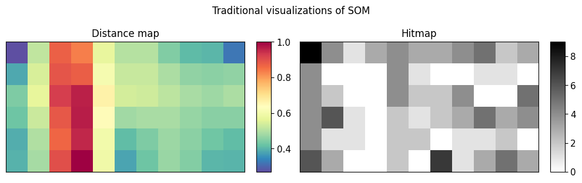
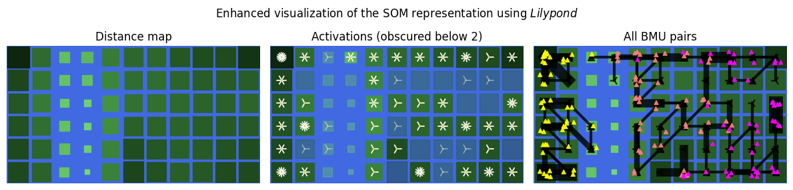

# Lilypond

*Lilypond* is a `matplotlib`-based Python visualization tool that leverages _Self-Organizing Maps (SOM)_ via the [MiniSom](https://github.com/JustGlowing/minisom) library, to make low-dimensional representation of high-dimensional data more **intuitive**.

## Motivation

Given a high-dimensional dataset at hand. We may want to visualize the data points but cannot go beyond three dimensions without dimensionality reduction. However, by using *Self-Organizing Maps (SOM)*, an organized representation in the original feature space can be learned and then flattened into a two-dimensional plane. The expectation is that data points that are similar in the original feature space will be positioned close to each other in the two-dimensional map.

Python implementation of SOM such as _MiniSom_ already exist, yet have limitations, such as cross-referencing issues due to separate visuals or cluster misinterpretation due to coloring.




## The Lilypond way

As the figure shows, *lilypond* **combines** the distance and hit maps into a **single** and **familiar visual**, where:

* water is a static blue background
* lily pads shrink according to how **far** they are located **from their neighbors**
* number of petals indicate the **activation** strength
* "roots" (black lines) indicate the connection of the first and second best-matching unit of training instances that could **strengthen clustering patterns** or when connect otherwise non-neighboring nodes **hint** on the **folding nature of the manifold**



## Installation and usage

The following is a brief look at the interface of Lilypond. For a detailed demonstration, visit the [examples/demonstration.ipynb](./examples/demonstration.ipynb) notebook.

```bash
pip install git+https://github.com/matthew-balogh/lilypond
```

```python
from minisom import MiniSom

# given X, hyperparams -> train a MiniSom object
som = MiniSom(**hyperparams)
som.random_weights_init(X)
som.train(X, ...)
```

```python
from lilypond.basin import Basin

# prepare the pond
basin = Basin(som, X, ...).prepare()
```

```python
# configure styling

coloring_strategy = "distance_map"
flood_below_activations = 2

pad_style = {
  "marker": "s",
  "gap": .1,
}

petal_style = {
  "magnifier": 3,
  "width": 1.25,
  "size_base": .4,
}

rhizome_style = {
  "zorder": 11,
  "marker_start": "^",
  "marker_end": "3",
  "opacity": .8,
  "linewidth": 3,
}

attract_style = {
  "cmap": cmap, # colormap
  "cmap_values": y_encoded, # true labels encoded
  "cmap_label": "Class",
  "label": "Iris",
  "zorder": 21,
  "marker": "^",
  "size_base": 18,
  "opacity": .9,
  "subsample_ratio": None,
}
```

```python
import matplotlib.pyplot as plt

# visualize distance + activation information
basin.pond() \
  .set_coloring_strategy(coloring_strategy) \
  .flood(below_activations=flood_below_activations) \
  .discretize_petals(n_bins=5) \
  .style_pad(**pad_style) \
  .style_petal(**petal_style) \
  .observe(title=f"Activations (obscured below {flood_below_activations})")

# visualize 1st/2nd BMU connections + true label information
basin.pond() \
  .set_coloring_strategy(coloring_strategy) \
  .flood(below_activations=0) \
  .style_pad(**pad_style) \
  .style_petal(hide=True) \
  .style_rhizome(**rhizome_style) \
  .see_rhizome(mode="all", ax=plt.gca()) \
  .attract(X, **attract_style) \
  .observe(title="BMU connections + True labels")
```
